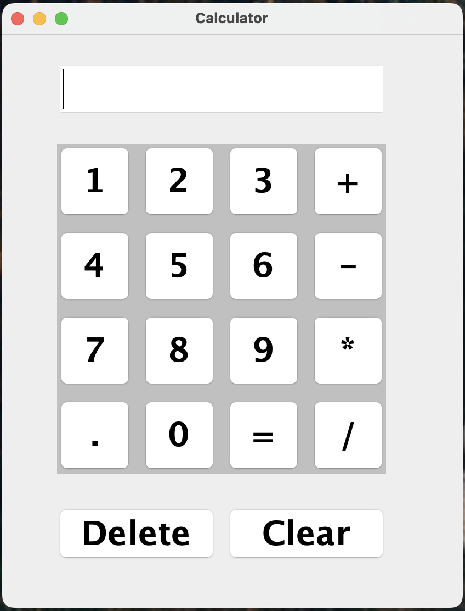

# 🧮 Java Swing Calculator

A simple and user-friendly calculator built using **Java Swing**. This GUI-based calculator supports all basic arithmetic operations with a clean layout.

---

## 💡 Features

- Basic arithmetic operations: `+`, `-`, `*`, `/`
- Decimal support
- Delete last digit
- Clear all input
- Responsive button-based UI
- Built with Java Swing (`JFrame`, `JPanel`, `JTextField`)

---

## 📷 Screenshot

---

## 🛠️ Tech Stack

- **Language**: Java
- **UI Framework**: Java Swing
- **IDE Recommendation**: VS Code, IntelliJ IDEA, or Eclipse

---
